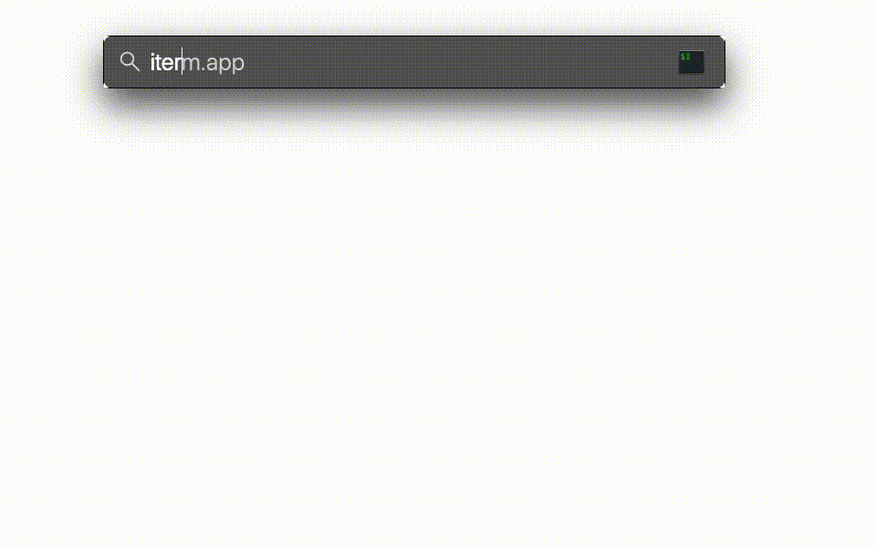

- [Usage:](#usage)
  - [Clone](#clone)
  - [Iterm2 configuration](#iterm2-configuration)
  - [vscode integrated terminal osx configuration](#vscode-integrated-terminal-osx-configuration)
  - [Description](#description)
  - [Example](#example)

# Usage: 

## Clone
`git clone https://github.com/abargiela/tmux_startup_session_selector.git ~/Documents/`

## Iterm2 configuration

In Preferences, go to: `Profiles -> General -> Command ` and choose: `login shell`

And add the path where this script is located: 

`bash ~/Documents/tmux_startup_session_selector/tmux_startup_session_selector.sh`

## vscode integrated terminal osx configuration

Press: `ctrl + shift + P` and write: `Preferences: Open Settings (JSON)` 

Here you have to add the full path, if you kept the suggested structure, just change `YOURUSER` to your username and it will work.

`"terminal.integrated.shellArgs.osx": ["/Users/YOURUSER/Documents/tmux_startup_session_selector/tmux_startup_session_selector.sh" ]`

If it doesn't work just restart vscode.

## Description

The main idea behind this script was to facilitate when I open a new terminal have an easy way to choose a new/existent/or skip a new session of tmux without type any command, so it's helpful for me, hope it can help you, suggestions are welcome.

## Example

